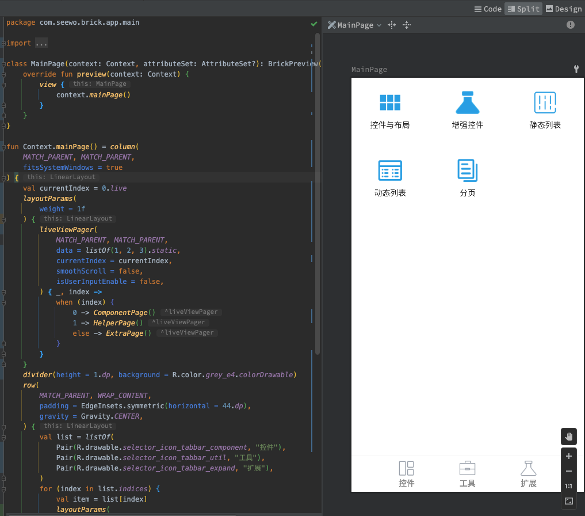

# BrickUI

[](https://jitpack.io/#robin8yeung/BrickUI)
[](./LICENSE)

受JetpackCompose启发，通过组合和声明的方式去搭建UI，就像用砖头垒出来的一样自然。


BrickUI是一套Kotlin实现的基于原生View体系的声明式UI框架。与原生View体系无缝对接，从此代码徒手撸layout，忘记你的xml吧~

加油搬砖人！

### 引入

Latest Version: [](https://jitpack.io/#robin8yeung/BrickUI)

> 具体VERSION 查阅 [CHANGELOG.md](CHANGELOG.md)

Add it in your root build.gradle at the end of repositories:
```groovy
allprojects {
	repositories {
		// ...
		maven { url 'https://jitpack.io' }
	}
}
```
Step 2. Add the dependency
```groovy
dependencies {
        implementation 'com.github.robin8yeung.BrickUI:brick-ui:{VERSION}'
        implementation 'com.github.robin8yeung.BrickUI:brick-ui-live:{VERSION}' // 非必须 基于LiveData封装BrickUI
        implementation 'com.github.robin8yeung.BrickUI:brick-ui-glide:{VERSION}' // 非必须 基于Glide封装图片加载函数
}
```

## Demo下载


[https://www.pgyer.com/brick](https://www.pgyer.com/brick)

demo中会简单展示BrickUI的各种特性和代码实例


## 总览

- 由于基于传统的View体系，可以在声明式UI中，直接添加原生View，并通过扩展函数apply等对所添加的view进行设置
- BrickUI使用到LiveData时，均会对Context强转为LifecycleOwner，所以需要保证使用的Activity为LifecycleOwner的子类，如ComponentActivity
- 与Jetpack Compose类似，BrickUI提供的widget均基于函数实现
- BrickUI基于kotlin和kotlin协程实现，所以kotlin和kotlin协程依赖是必须的，不推荐在java下使用
- 可通过 import com.seewo.brick.ktx.* 来引入依赖

## 初心

- Android原生还没有较成熟的声明式，受JetpackCompose启发，就自己撸一个
- xml写layout，drawable的方式有点烦
- DataBinding把代码写在xml上，不是很优雅；而且时序等方面有一些坑
- DataBinding其实并没有真正的双向绑定
- BindingAdapter虽然还算方便，但坑也比较多；另外嵌套依赖的BindingAdapter会造成编译慢和编译异常的风险

## 与一般声明式UI框架的区别

- 只是UI框架，基于Android的View体系，非跨平台框架。主要为了取代xml、DataBinding
- 并非 UI = f(state) 的实现方式，更新ui主要通过View引用，View的id索引，和其他框架如LiveData等

## lib介绍

- brick-ui-core：核心库，包含通用工具类、ViewModel基类和基本Widget、drawable封装
- brick-ui-live：基于LiveData的widget实现
- brick-ui-glide：基于glide实现的图片加载widget

## 特性

### 总览

#### BrickUI中的容器类widget的构造扩展函数一般有两种：

```kotlin
fun Context.something() {
    // Context的扩展方法
}

fun ViewGroup.something() {
    // ViewGroup的扩展方法
}
```

需要注意这两种不同接受者的扩展构造方法的差异，否则容易引起以下异常
```
java.lang.IllegalStateException: The specified child already has a parent. You must call removeView() on the child's parent first.
```

- Context的扩展方法构造出来的View是没有parent的，需要业务方把它添加到一个父View中，如通过Activity中的setContentView(view)，BrickUI的brick { view } 等
- ViewGroup的扩展方法构造出来的View已经把接受者ViewGroup作为了parent，此时就不需要，也不能另外把它添加到其他ViewGroup中

> 实现原理参考: [BrickUI实现](doc/BrickUI.md)

### 容器类widget

#### column、row、linearLayout

传统线性布局，提供了expend空间用于快速描述展开撑满的一片占位区域。
通过buildColumn、buildRow，可以通过列表来快速构造column和row，但不建议通过这种方式来构造太庞大的线性布局，因为不会对item进行回收；如果需要构造庞大的布局，请还是使用recyclerView

#### scrollView

即传统的ScrollView

#### frameLayout、relativeLayout

与普通的FrameLayout和RelativeLayout类似。

#### simpleRecyclerView

与flutter类似的RecyclerView构建方式，和RecyclerView.Adapter说再见

> 实现原理参考：[RecyclerView实现](doc/RecylerView.md)

#### 布局助手

需要设置widget在布局中的属性，可以通过相关的布局助手函数实现，如 LinearLayout.layoutParams()、RelativeLayout.layoutParams()等

### View类widget

目前实现 textView、editText(实验)、imageView 等基本widget

### Drawable构造

为避免通过xml来描述shape，提供了通过函数去声明Drawable的方式

```kotlin
rectDrawable(
    width = 16.dp, height = 16.dp,
    fillColor = R.color.teal_200.color,
    strokeColor = Color.RED,
    strokeWidth = 1.dp,
    corners = CornerRadius.only(rightTop = 2.dp),
)
```
### Margin/Padding属性

类似Flutter的EdgeInsets。但需要注意的是padding属于View自身属性，margin则属于View的布局属性。所以设置的地方有点区别
```kotlin
layoutParams(
    margin = EdgeInsets.all(8.dp)
) {
    textView(
        text = "你好",
        textColor = Color.BLACK.static,
        padding = EdgeInsets.all(8.dp),
        textSize = 16.dp,
    )
}
```

### shadowBox：外阴影

通过代码来构造外阴影，为开发者提供类似前端构造box-shadow类似的开发体验

```kotlin
shadowBox(
    radius = 4.dp,
    shadow = Shadow(
        blur = 5.dp,
        color = Color.GRAY.withAlpha(0.5f),
        offsetX= 1.dp,
        offsetY= 1.dp,
    ),
) {
    textView(
        text = "你好",
    )
}
```

### 工具类扩展函数/扩展属性

工具类用于帮助开发者在声明式UI里面快速描述像素和资源

#### 像素工具

BrickUI内的像素值与View体系一致，是基于px的，如果希望使用dp单位，可以在数字后直接加扩展属性dp
```kotlin
textView(
    text = "text",
    textSize = 28.dp,
)
```

#### resource工具

通过扩展属性替代普通的resource操作，如 R.string.xxx.string、R.drawable.xxx.drawable、R.color.xxx.color

```kotlin
textView(
    text = R.string.text.string,
    textColor = R.color.red.color,
    background = R.drawable.bg.drawable,
)
```
#### activity工具

实现简单的全屏、状态栏设置、Activity启动等
```kotlin
class SomewhatActivity : AppCompatActivity() {

    override fun onCreate(savedInstanceState: Bundle?) {
        super.onCreate(savedInstanceState)
        setStatusBarTransparent(true)
        setFullScreen(true)
        if(needArguments) {
            startActivity<NextActivity> {
                putExtra("key", "value")
            }
        } else {
            startActivity<NextActivity>()
        }
    }
}
```

### LiveData 力(Live)大砖(Brick)飞

brick-ui-live 基于LiveData的数据绑定，让BrickUI动起来

- 提供 liveText、liveImage 等widget，通过LiveData属性来完成数据绑定
- 提供 LiveData.map()方法来对数据进行转换
- 提供扩展属性来帮助开发者快速定义LiveData，如 val count: MutableLiveData<Int> = 1.live

```kotlin

val count = 0.live

liveText(
    text = count.map { it.toString },
    textColor = count.map { if (it % 2 == 0) Color.RED else Color.BLACK },
) {
    count.value = count.value!! + 1
}
```

#### 提供扩展属性来帮助开发者快速定义不需要变化的LiveData
```kotlin
val text = 1.static
val color = R.color.red.COLOR // 相当于 R.color.red.color.static
```

## 架构

### BrickUI的mvvm demo

与Flutter的默认demo类似，这里给到一个简单的计数器demo，用于阐释一个带有具体业务的例子。
BrickUI作为基于View体系的一套框架，对标的实际更多是DataBinding，所以最佳实践仍然是采用MVVM架构。

```kotlin
class CounterActivity : AppCompatActivity() {
    override fun onCreate(savedInstanceState: Bundle?) {
        super.onCreate(savedInstanceState)
        setContentView(counterPage())
    }
}

class CounterPageViewModel(application: Application): AndroidViewModel(application) {
    private val count: LiveData<Int> = 0.live

    override fun onCleared() {
        Log.e("brick", "onCleared")
    }

    fun plus() {
        count.data = count.data + 1
    }

    fun minus() {
        count.data = count.data - 1
    }
}

fun Context.counterPage() = row(
    MATCH_PARENT, MATCH_PARENT,
    gravity = Gravity.CENTER,
    fitsSystemWindows = true,
) {
    button("-") {
        viewModel.minus()
    }
    liveText(
        84.dp,
        style = R.style.BigNumber,
        text = viewModel.count.map { it.toString() },
        textColor = viewModel.count.map { if (it % 2 == 0) Color.RED else Color.BLACK },
        padding = EdgeInsets.all(12.dp),
    )
    button("+") {
        viewModel.plus()
    }
}

private fun ViewGroup.button(
    text: String,
    onClick: View.OnClickListener) =
    shadowBox(
        width = 100.dp, height = 100.dp,
        radius = 14.dp, shadow = Shadow(radius = 8.dp),
        onClick = onClick
    ) {
        textView(
            text = text,
            textSize = 28.dp,
            textStyle = Typeface.BOLD,
        )
    }
```

## 已接入应用

| 希沃白板                | C来电                      | 评课直播                        | 学情采集                       |
|---------------------|--------------------------|-----------------------------|----------------------------|
|  |  |  |  |

## 已知问题

### 1、即时预览机制较薄弱

原生xml的即时预览机制，帮助开发者修改ui的同时快速预览修改。Compose也有类似的机制。
Flutter虽然官方没有快速预览插件，但得益于热重载，UI修改可以快速应用到真机上。
BrickUI暂时无法提供快速预览机制，只能依赖Android Studio现成的预览机制。每次修改均需refresh，且要注意没有预览相关的编译问题

预览类继承BrickPreview
```kotlin
class MainPage(context: Context, attributeSet: AttributeSet?): BrickPreview(context, attributeSet) {
    override fun preview(context: Context) {
        view {
            context.mainPage()
        }
    }
}
```

### 2、缺少IDE快捷操作的支持

本质依然是kotlin代码，缺少插件支持，没办法像Flutter那样通过快捷操作修改代码，只能依赖传统kotlin的一些快捷操作

### 3、为了更好的实现声明式UI，可能造成一定的性能开销

为了更好的实现声明式UI，可能造成一定的性能开销。如layout嵌套，额外对象创建等

## 实现参考

- 整体实现 [BrickUI实现](doc/BrickUI.md)
- RecyclerView实现 [RecyclerView实现](doc/RecylerView.md)


## License
BrickUI is [Apache v2.0 licensed](./LICENSE).